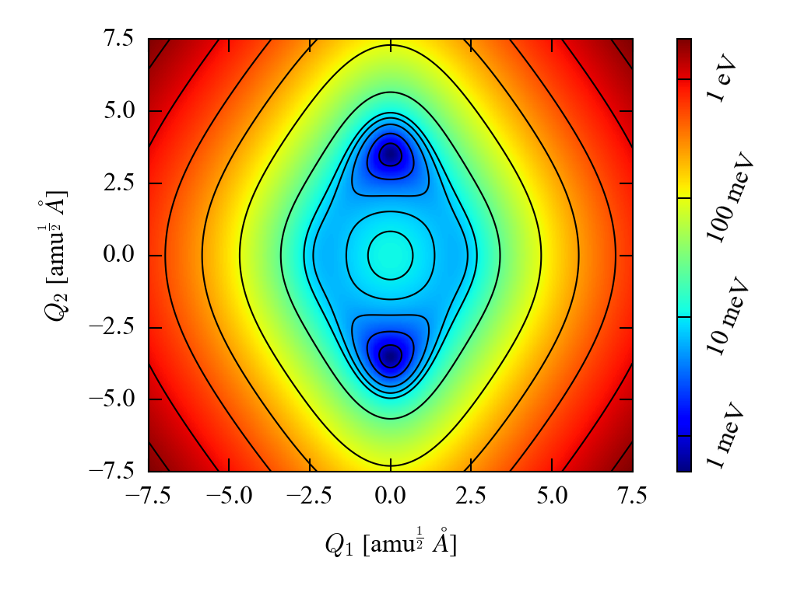
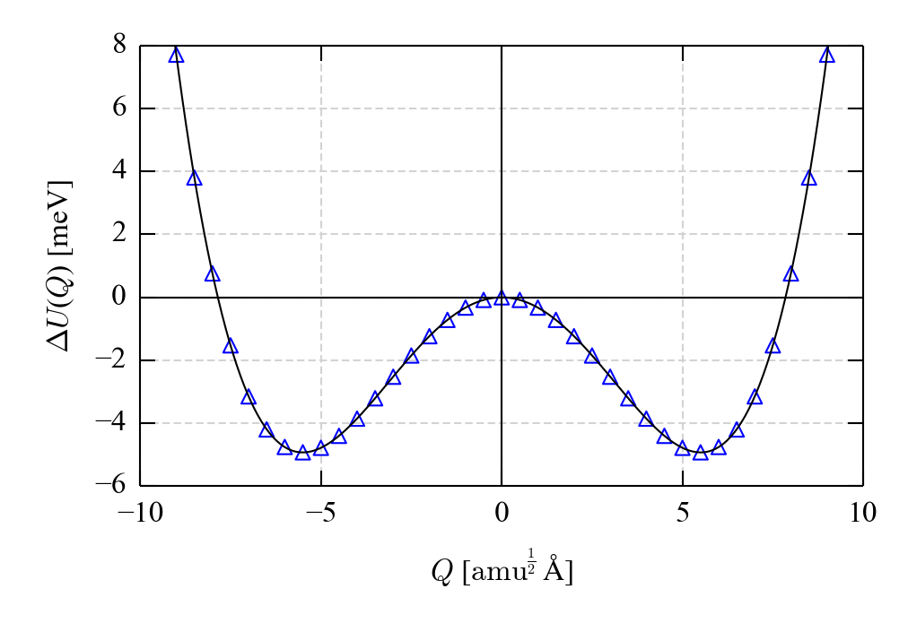
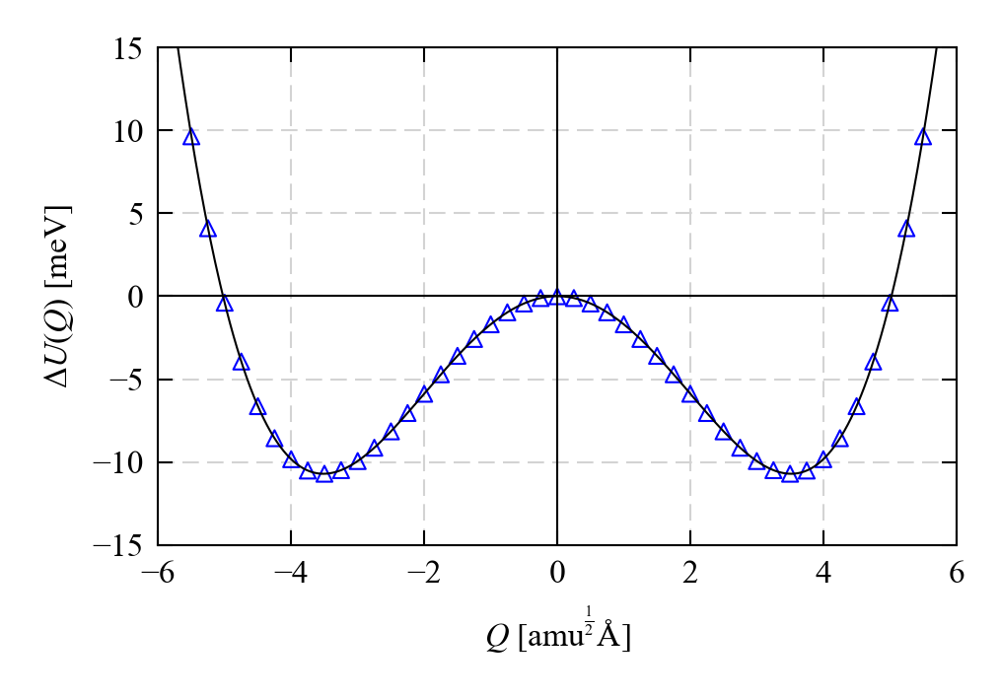

Example: *Cmcm* SnSe
====================

An example which uses the `ModeMap*` scripts and the 1D Schro&ouml;dinger solver to analyse the two principal imaginary modes in the high-temperature *Cmcm* phase of SnSe.

Harmonic Phonopy calculation
----------------------------

The optimised (athermal) structure of *Cmcm* SnSe and the Phonopy `FORCE_SETS` calculation obtained from a harmonic phonon calculation on the conventional cell are contained in the root directory.

These are sufficient to run the calculations in this example, but those wishing to reproduce the complete calculation can find further technical details in [Ref. 1](#Ref1) and raw data in [this repository](https://doi.org/10.15125/BATH-00258).

2D potential-energy surface
---------------------------

Sample input and output files are stored in [2DMap](./2DMap). The example is run as follows:

1. Generate a sequence of modulated structures:
   
   `python ModeMap.py -c POSCAR.vasp --dim="1 1 1" --map_2d --mode_1="0 0 0 1" --mode_2="0 0 0 2" --q_range="-20 20 1" --supercell="1 1 1"`
   
   Information about the structures is written to `ModeMap.csv`, and the structures (in VASP `POSCAR` format) are archived to `ModeMap.tar.gz`.

2. Perform single-point energy calculation on the displaced structures (X in total).
   Example `INCAR` and `KPOINTS` files are provided for this (`INCAR.SinglePoint` and `KPOINTS.SinglePoint`, respectively), and users will also need the Sn_d and Se PAW PBE potentials (both dated 06-Sep-2000) from the VASP database.
   Once the calculations have been completed, extract the total energies to a CSV-format file (see `ExtractTotalEnergies.py` for an example script).
   The required format is illustrated in `ExtractTotalEnergies.csv`.

3. Post process the output:

   `python ModeMap_PostProcess.py --map_2d`

   The 2D potential map is written to `ModeMap_PostProcess_2DMap.csv`, and the potentials along the *Q*1 = 0 and *Q*2 = 0 slices of the sufrace are written to `ModeMap_PostProcess_1DProfiles.csv`.

Plotting the surface obtained in #3 should yield a result similar to the following:

Effective harmonic frequencies
------------------------------

These instructions apply to the example files in both the [Mode1-HighResolution](./Mode1-HighResolution) and [Mode2-HighResolution](./Mode2-HighResolution) directories.

1. Generate a sequence of modulated structures:

   For mode 1: `python ModeMap.py -c POSCAR.vasp --dim="1 1 1" --mode="0 0 0 1" --q_range="-25 25 0.5" --supercell="1 1 1"`  
   For mode 2: `python ModeMap.py -c POSCAR.vasp --dim="1 1 1" --mode="0 0 0 2" --q_range="-35 35 0.5" --supercell="1 1 1"`

2. Run the single-point total-energy calculations and collect the output (see #2 in the 2D example above).

3. Post process the output:

   `python ModeMap_PostProcess.py`
   
   For 1D maps, the result is written to `ModeMap_PostProcess.csv`.

4. Fit the calculated potential-surface maps to polynomial functions:

   For mode 1: `python ModeMap_PolyFit.py --degree=20 --plot_x="-10 10" --plot_y="-6 8"`  
   For mode 2: `python ModeMap_PolyFit.py --degree=20 --plot_x="-20 20" --plot_y="-15 15"`
   
   You should obtain plots similar to the following:
   
   
   

5. Use the fitted polynomial coefficients with the 1D Schr&ouml;dinger solver code to compute the energy levels of the anharmonic potentials, and to calculate an effective (renormalised) harmonic frequency as a function of temperature.
   
   This can be done using the `LoopTemperatures.sh` script included in the code directory (modify the `Run()` function with the location of your compiled binary):
   
   `./LoopTemperatures.sh`

References
----------

1. J. M. Skelton, L. A. Burton, S. C. Parker, A. Walsh, C.-E. Kim, A. Soon, J. Buckeridge, A. A. Sokol, C. R. A. Catlow, A. Togo and I. Tanaka, "Anharmonicity in the High-Temperature *Cmcm* Phase of SnSe: Soft Modes and Three-Phonon Interactions", *Physical Review Letters* **117**, 075502 (**2016**), DOI: [10.1103/PhysRevLett.117.075502](https://doi.org/10.1103/PhysRevLett.117.075502)
